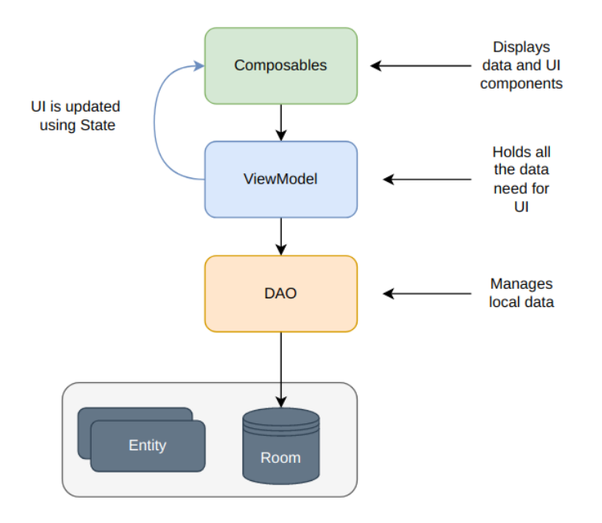

# **Observer** #

## Description
The "Observer" mobile app for tracking the expiry date is designed for Android platform to help users keep track of when 
their food or other products, such as medicines.

## Database
Room Database is used for data persistence. The use of Room database is best practice for application development because 
Room database allows more powerful and easier work with local application data and provides a more secure and compatible 
environment for working with the database on the platform Android. Between Room Database and Entities is the DAO. 
We used the DAO design pattern for robust and efficient data manipulation.

## More information in [documentation](https://github.com/tsayvyac/cvut-projects/blob/master/%5BPDA%5D%20Principles%20of%20mobile%20applications/semestral-project/documentation/D2.pdf)

## Used libraries:
- Android Jetpack Compose
- Material Design 3
- Room Database
- Android Workers
- AndroidX Camera
- Notification Manager
- Coil
